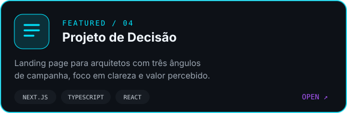
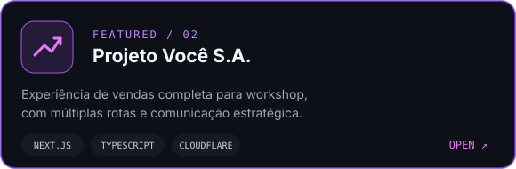
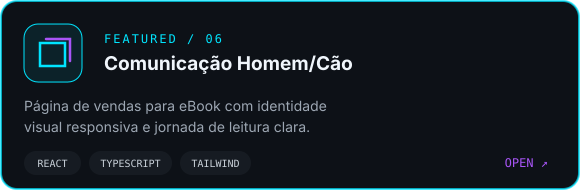

<!--
  Profile README for github.com/LucasPTF
  Visual system: NEON CORE / cyan + violet
-->

<div align="center">
  
</div>

<div align="center">
  
</div>

<div align="center">
  
  
  
</div>

<br />

## `01. SOBRE_MIM`

<table>
  <tr>
    <td width="58%" valign="top">
      <h3>Olá, eu sou o Lucas 👋</h3>
      <p>
        Desenvolvedor front-end focado em transformar estratégia e copy em
        <strong>interfaces rápidas, responsivas e orientadas a conversão</strong>.
      </p>
      <p>
        Construo landing pages e experiências digitais com atenção à hierarquia
        visual, performance, acessibilidade e clareza — do primeiro componente ao deploy.
      </p>
      <p>
        <code>design + código + estratégia = experiência que entrega resultado</code>
      </p>
    </td>
    <td width="42%" valign="top">
      <h3>NEON_CORE.info</h3>
      <pre>
ROLE       Front-end Developer
BASE       Brasil
SPECIALTY  Landing Pages
STATUS     Building
MINDSET    Always learning
      </pre>
    </td>
  </tr>
</table>

## `02. TECH_STACK`

<div align="center">
  <p><strong>Core</strong></p>
  
</div>

<br />

<div align="center">
  <p><strong>Ferramentas &amp; Deploy</strong></p>
  
</div>

## `03. PROJETOS_EM_DESTAQUE`

<div align="center">
  <a href="https://github.com/LucasPTF/jesiel-projeto-de-decisao">
    
  </a>
  <a href="https://github.com/LucasPTF/roger">
    
  </a>
</div>

<div align="center">
  <a href="https://github.com/LucasPTF/marcelo-miranda">
    
  </a>
</div>

<div align="center">
  <a href="https://github.com/LucasPTF?tab=repositories">
    
  </a>
</div>

## `04. MISSÃO_ATUAL`

```console
lucas@neon-core:~$ mission --status

[✓] Criando landing pages de alta conversão
[>] Aprofundando Next.js, TypeScript e performance web
[>] Refinando sistemas de UI, acessibilidade e motion
[+] Explorando IA aplicada a produtos e experiências digitais

SYSTEM: evolução contínua habilitada_ 
```

## `05. TELEMETRIA_GITHUB`

<div align="center">
  
  
</div>

<div align="center">
  
</div>

<div align="center">
  
</div>

## `06. TROPHY_VAULT`

<div align="center">
  
</div>

## `07. CONTRIBUTION_STREAM`

<div align="center">
  
</div>

## `08. ESTABELECER_CONEXÃO`

<div align="center">
  <a href="https://github.com/LucasPTF">
    
  </a>
  <a href="https://github.com/LucasPTF?tab=repositories">
    
  </a>
</div>

<br />

<div align="center">
  
  <sub>Projetado com intenção. Construído com código. Evoluindo a cada commit.</sub>
</div>
